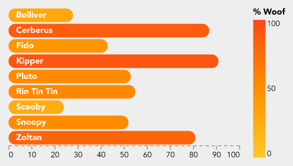
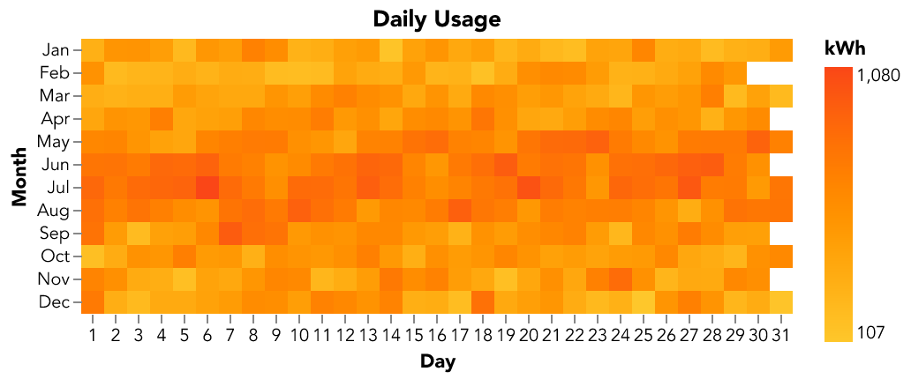

# Charts and Graphs in Docma


Docma supports the [Vega-Lite](https://vega.github.io/vega-lite/) declarative
syntax for specifying charts / graphs. Vega-Lite specifies a mapping between
source data and visual representations of the data.

To make all this work in docma requires three things:

1.  A means to tell docma that a chart needs to be generated. This is done using
    a special URL format within `` tags in the source HTML.
    See [Invoking Charts in HTML Source Documents](#invoking-charts-in-html-source-documents).

2.  A means to specify the design of the chart. This is done with a
    [chart specification file](#chart-specification-files) within the document
    template.

3.  A means to feed data to the chart creation process.
    See [Source Data for Charts](#source-data-for-charts).

## Invoking Charts in HTML Source Documents

Docma provides a URL based mechanism to trigger creation of charts during the
process of converting HTML to a PDF or HTML output document. See
[Dynamic Content Generation](05-docma-template-rendering.md#dynamic-content-generation) for more details.

It looks like this:

```html

```

In a nutshell, when docma sees a URL in this form, it knows to
get data from the source specified by the `data` parameter and feed it into the
chart generator with the Vega-Lite specification indicated by the `spec`
parameter:

Normal CSS styling can also be applied:

```html

```

Here is a more complete example, showing how Jinja can help build the `src` URL
structure safely:

```html

```

See also [docma scheme parameters for vega charts](05-docma-template-rendering.md#generating-charts-and-graphs).

## Chart Specification Files

The chart specification is a file in the document template containing a
[Vega-Lite](https://vega.github.io/vega-lite/) chart definition.

The chart specification will be Jinja rendered prior to use.

The chart specification can be in either JSON or YAML format.
Docma doesn't care which. There are pros and cons with each format.
YAML is easier to write and to read but JSON is the native format of the
examples in the [Vega-Lite sample gallery](https://vega.github.io/vega-lite/examples/)
or the [Vega-Lite on-line editor](https://vega.github.io/editor/#/). You're 
going to want to use both of these resources.


The chart specification file should still have a `.yaml` suffix, even if the
contents are JSON. This all works because valid JSON is also valid YAML.

> Note that docma uses the [Vega-Altair](https://altair-viz.github.io/index.html)
> Python package to process Vega-Lite specifications.

## Source Data for Charts

The value of the `data` parameter in a `docma:vega?...` URL is a docma [data
source specification](07-data-sources-in-docma.md#data-source-specifications) that indicates where to obtain
the data and where to attach it to the chart specification.

The `data` parameter can be used multiple times if there are multiple data
sources in the chart.

If the `data` parameter is not specified, the source data is assumed to be
contained within the chart specification itself. This can actually be useful
when designing a chart to avoid the need to wrangle external data when
experimenting.

See [Data Sources in Docma](07-data-sources-in-docma.md#data-sources-in-docma) for more information.


## Tips and Suggestions for Designing Charts

The [Vega-Lite website](https://vega.github.io/vega-lite/) has lots of resources
to help with designing charts. This section just provides a few tips and
suggestions.

Some suggestions for simplifying the development:

*   Where possible, start with a chart from the
    [Vega-Lite sample gallery](https://vega.github.io/vega-lite/examples/) and
    play with it in the on-line editor to get close to what you are after.

*   Include a small sample data set in the chart specification to allow
    experimentation. The sample data can be left in the specification when
    included into a docma document template. Docma will replace it at run-time.

*   Charts reference a JSON schema:
    `$schema: https://vega.github.io/schema/vega-lite/v5.json`. PyCharm will
    interpret this and provide some auto completion and validation as you go.

*   Believe it, or not, but ChatGPT is surprisingly helpful with Vega-Lite. It
    can often give meaningful answers to enquiries like these:

    *   *Explain this Vega-Lite specification to me ... (paste the JSON in)*

    *   *I have this Vega-Lite specification. How do I remove the axes and
        change the colour on the bars?*

    *   *Design a Vega-Lite chart that shows a heat map of ... with ... on the x
        axis and ... on the y axis*

*   ChatGPT can get confused with obscure concepts (like interval meter data).
    You can often replace this with more generic data in the questions
    (temperature data is a good substitute for interval data).

*   [Layers](https://vega.github.io/vega-lite/docs/layer.html) are quite an
    important concept in Vega-Lite. Make an effort to understand them.


## Samples

With a bit of effort, Vega-Lite does a surprisingly good job of generating good
looking charts with a small amount of specification.

Here are a few examples.


### Bar Chart

This is a bar chart of dog woof-power.



This is the specification file (with truncated data).

```yaml
$schema: 'https://vega.github.io/schema/vega-lite/v5.json'
width: 300
config:
  font: Avenir
  background: '#eeeeee'
  padding: 10
  view:
    stroke: transparent
  axisX:
    grid: false
    gridWidth: 0.5
    domainDash:
      - 4
      - 4
    formatType: number
  axisY:
    grid: false
data:
  values:
    - Dog: Bolliver
      Woof: 28
view:
  fill: '#eeeeee'
encoding:
  'y':
    field: Dog
    title: Dog
    type: ordinal
    axis: null
layer:
  - mark:
      type: bar
      cornerRadius: 20
    encoding:
      x:
        field: Woof
        title: null
        type: quantitative
      color:
        field: Woof
        type: quantitative
        title: '% Woof'
        scale:
          domain: [ 0, 100 ]
          range: [ '#fec72b', '#fa4617' ]
  - mark:
      type: text
      align: left
      x: 10
      color: white
      fontWeight: bold
    encoding:
      text:
        field: Dog
```


### Interval Meter Data Heat Map

This is a heat map of interval meter data by day and month.



This is the specification file (with truncated data).

```yaml
$schema: 'https://vega.github.io/schema/vega-lite/v5.json'
title: 'Daily Usage'
config:
  font: Avenir
  view:
    continuousWidth: 300
    continuousHeight: 300
    step: 13
    strokeWidth: 0
  axis:
    domain: false
data:
  name: usage_by_day

mark:
  type: rect
encoding:
  color:
    aggregate: max
    field: kwh
    legend:
      title: kWh
    type: quantitative
    scale:
      range: [ '#fec72b', '#fa4617' ]
  x:
    axis:
      format: '%e'
      labelAngle: 0
    field: date
    timeUnit: date
    title: Day
    type: ordinal
  y:
    field: date
    timeUnit: month
    title: Month
    type: ordinal
datasets:
  # Sample data -- this gets replaced
  usage_by_day:
    - date: 2023-07-01
      kwh: 1234
```


